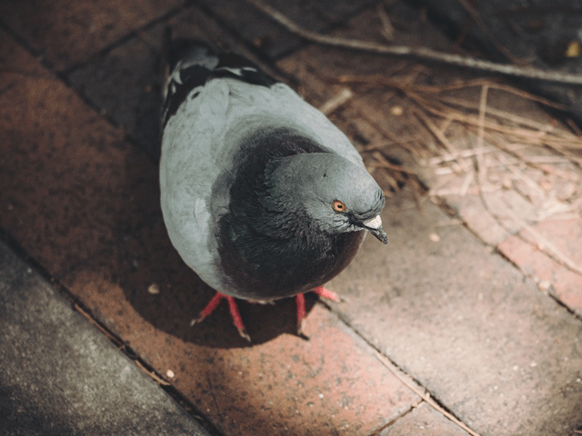

# Dovelet

Dovelet is both a Go wrapper library for the Google Cloud Vision API and a tool to make queries using such wrapper.

[](https://github.com/EdoardoLaGreca/dovelet/actions/workflows/go.yml)
[](https://goreportcard.com/report/github.com/EdoardoLaGreca/dovelet)

The [original Pigeon](https://github.com/kaneshin/pigeon) tool and library used a deprecated Google Cloud Vision API. One reason could be that, at the time of writing, its last commit was on Oct 14 2020, which means that the API may have become deprecated somewhere after the last commit. This fork attempts to stay up to date and to pursue a similar purpose. Apart from the usage of deprecated APIs, I think that the original Pigeon codebase was unnecessarily complex. This fork has been renamed to distinguish it from the original.

## Requirements

You need to create a shell variable named `GOOGLE_APPLICATION_CREDENTIALS` which holds the path of your Service Account private key (replace `/path/to/service_account.json`). The key type must be JSON.

```sh
GOOGLE_APPLICATION_CREDENTIALS=/path/to/service_account.json
export GOOGLE_APPLICATION_CREDENTIALS
```

To generate the credentials file refer to ["Authentication with service accounts"](https://cloud.google.com/vision/docs/setup#sa) and ["Create a service account key"](https://cloud.google.com/iam/docs/keys-create-delete#creating).

## The `dovelet` tool

The `dovelet` executable binary is a command-line tool to interface with the Google Cloud Vision API.

### Installation

#### Using `go install`

```sh
go install github.com/EdoardoLaGreca/dovelet/cmd/dovelet@latest
```

#### Building from source

```sh
git clone https://github.com/EdoardoLaGreca/dovelet
cd dovelet
go install ./cmd/dovelet # or: go build ./cmd/dovelet
```

### Usage

Use the `dovelet` command to make requests. The syntax is as follows.

```sh
dovelet -text [ -lang l1,l2,... ] files ...
dovelet -doc [ -lang l1,l2,... ] files ...
dovelet -face files ...
dovelet -image-properties files ...
dovelet -label files ...
dovelet -landmark files ...
dovelet -logo files ...
dovelet -safe-search files ...
```

Where:
- `l1,l2,...` are language hints for better accuracy (see "`languageHints` code" in [Supported languages](https://cloud.google.com/vision/docs/languages#supported-langs))
- `files ...` is one or more files to use in the request

You can find more details using `dovelet -h`.

<!-- TODO: make new gif -->
<!--  -->

## The `dovelet` package

The `dovelet` package contains types and functions for simple Cloud Vision queries.

### Installation

```sh
go get https://github.com/EdoardoLaGreca/dovelet
```

### Usage

Refer to [`cmd/dovelet/main.go`](cmd/dovelet/main.go) for an example.

## Examples

### Pigeon

input:



```sh
dovelet -label assets/pigeon.png
```

output:

```json
[
  {
    "label_annotations": [
      {
        "mid": "/m/015p6",
        "description": "Bird",
        "score": 0.96299416,
        "topicality": 0.96299416
      },
      {
        "mid": "/m/01c09k",
        "description": "Stock dove",
        "score": 0.8821084,
        "topicality": 0.8821084
      },
      {
        "mid": "/m/01c4rd",
        "description": "Beak",
        "score": 0.87776655,
        "topicality": 0.87776655
      },
      {
        "mid": "/m/036k5h",
        "description": "Grey",
        "score": 0.8444576,
        "topicality": 0.8444576
      },
      {
        "mid": "/m/01c08f",
        "description": "Rock dove",
        "score": 0.83560807,
        "topicality": 0.83560807
      },
      {
        "mid": "/m/01k0mv",
        "description": "Road surface",
        "score": 0.8078585,
        "topicality": 0.8078585
      },
      {
        "mid": "/m/0dfgf",
        "description": "Feather",
        "score": 0.8044634,
        "topicality": 0.8044634
      },
      {
        "mid": "/m/083s2",
        "description": "Wing",
        "score": 0.74377084,
        "topicality": 0.74377084
      },
      {
        "mid": "/m/07sx2n",
        "description": "Natural material",
        "score": 0.6731261,
        "topicality": 0.6731261
      },
      {
        "mid": "/m/0hr8",
        "description": "Asphalt",
        "score": 0.6372245,
        "topicality": 0.6372245
      }
    ]
  }
]
```

### Lenna

input:


```sh
dovelet -safe-search assets/lenna.jpg
```

output:

```json
[
  {
    "safe_search_annotation": {
      "adult": 2,
      "spoof": 1,
      "medical": 2,
      "violence": 1,
      "racy": 4
    }
  }
]
```

## License

[MIT](LICENSE)

## Credits

- Author of the original software: [Shintaro Kaneko](https://github.com/kaneshin)
